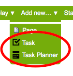
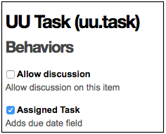

uu.task: UPIQ Task Management Add-on for Plone
==============================================

This repository serves as a place for development of a task managment add-on.

Introduction
------------

``uu.task`` provides configurable, effective **task-related email notifications** to **assigned parties**. It includes:

1. A system for project managers to assign content items, such as forms and events, as "tasks" with due dates to assigned parties
#. A means for assigned parties to receive email notification about tasks **at specific times**
#. A mechanism for assigned parties to communicate task status to project managers and set notification preferences

Copyright
---------

All content within this repository, unless otherwise noted elsewhere, is
Copyright 2015, University of Utah.  

Original works in this package are licensed under the GNU General Public
License v. 2.0. All original images, documentation, style-sheets, and 
JavaScript assets are additionally licensed under an MIT-style license.

See ``doc/COPYING.txt``

Contributors
------------

* `Sean Upton <https://github.com/seanupton>` (UPIQ, University of Utah Health Sciences)
* `Alex Clark <http://aclark.net/>` (ACLARK.NET, LLC)

Content Types
-------------

``uu.task`` adds content types:

- **Task**
- **Task Planner**

Behaviors
---------

``uu.task`` adds a behavior:

- **Assigned Task**

Similar Add-ons
---------------

``uu.task`` is inspired by similar add-ons. Here is a list and comparison of each.

+--------------------------------------+---------------------------------------+---------------------------------------+---------------------------------------+
|                                      |                                       |                                       |                                       |
|                                      |                                       |                                       |                                       |
| **Add-ons**                          |  **Description**                      |  **Pros**                             |  **Cons**                             |
|                                      |                                       |                                       |                                       |
|                                      |                                       |                                       |                                       |
+--------------------------------------+---------------------------------------+---------------------------------------+---------------------------------------+
|                                      |                                       |                                       |                                       |
|                                      |                                       |                                       |                                       |
| Products.Poi_                        | Venerable AT-based issue tracker.     | N/A                                   | N/A                                   |
|                                      | Includes workflow for issue tracker   |                                       |                                       |
|                                      | and task.                             |                                       |                                       |
|                                      |                                       |                                       |                                       |
|                                      |                                       |                                       |                                       |
|                                      |                                       |                                       |                                       |
|                                      |                                       |                                       |                                       |
+--------------------------------------+---------------------------------------+---------------------------------------+---------------------------------------+
|                                      |                                       |                                       |                                       |
|                                      |                                       |                                       |                                       |
| collective.project_                  | Project management add-on whose       | N/A                                   | N/A                                   |
|                                      | Dexterity content types can behave    |                                       |                                       |
|                                      | like a collective.task_ task. E.g.    |                                       |                                       |
|                                      | "project", "client", "iteration".     |                                       |                                       |
|                                      | "Task" content                        |                                       |                                       |
|                                      | type included with                    |                                       |                                       |
|                                      | `collective.project`_ cannot be used  |                                       |                                       |
|                                      | with collective.task_                 |                                       |                                       |
|                                      | due to conflicting                    |                                       |                                       |
|                                      | "task" types.                         |                                       |                                       |
|                                      |                                       |                                       |                                       |
|                                      |                                       |                                       |                                       |
|                                      |                                       |                                       |                                       |
|                                      |                                       |                                       |                                       |
+--------------------------------------+---------------------------------------+---------------------------------------+---------------------------------------+
|                                      |                                       | It exists.                            | Supports "placeful" tasking.          |
|                                      |                                       |                                       |                                       |
| collective.task_                     | Supports "placeful" tasking. A task is+---------------------------------------+---------------------------------------+
|                                      | a folder that can contain other       | Allows assignment of task to group,   | No date widget.                       |
|                                      | (presumably dependent) tasks.         | user and "enquirer".                  |                                       |
|                                      |                                       +---------------------------------------+---------------------------------------+
|                                      |                                       | Includes "task" behavior which can    | Possibly no support for assignment of |
|                                      |                                       | be used by other Dexterity content.   | `more than one principal`_.           |
|                                      |                                       +---------------------------------------+---------------------------------------+
|                                      |                                       | Can be used as a task framework       |                                       |
|                                      |                                       | by other add-ons.                     |                                       |
|                                      |                                       +---------------------------------------+---------------------------------------+
|                                      |                                       |                                       |                                       |
|                                      |                                       |                                       |                                       |
|                                      |                                       +---------------------------------------+---------------------------------------+
|                                      |                                       |                                       |                                       |
|                                      |                                       |                                       |                                       |
+--------------------------------------+---------------------------------------+---------------------------------------+---------------------------------------+
|                                      |                                       |                                       |                                       |
|                                      |                                       |                                       |                                       |
|                                      |                                       |                                       |                                       |
|                                      |                                       |                                       |                                       |
|                                      |                                       |                                       |                                       |
+--------------------------------------+---------------------------------------+---------------------------------------+---------------------------------------+

.. _`Products.Poi`: https://github.com/collective/Products.Poi
.. _`collective.project`: https://github.com/collective/collective.project
.. _`collective.task`: https://github.com/collective/collective.task
.. _`more than one principal`: https://github.com/upiq/uu.task/issues/3

Developers
----------

Testing
~~~~~~~

Developers please run tests before committing e.g. ::

    $ make
    check-manifest
    lists of files in version control and sdist match
    pyroma .
    ------------------------------
    Checking .
    Found uu.task
    ------------------------------
    Final rating: 10/10
    Your cheese is so fresh most people think it's a cream: Mascarpone
    ------------------------------
    flake8 uu/task/*.py
    ./parts/plone/bin/interpreter setup.py test
    running test
    running egg_info
    writing requirements to uu.task.egg-info/requires.txt
    writing uu.task.egg-info/PKG-INFO
    writing namespace_packages to uu.task.egg-info/namespace_packages.txt
    writing top-level names to uu.task.egg-info/top_level.txt
    writing dependency_links to uu.task.egg-info/dependency_links.txt
    writing entry points to uu.task.egg-info/entry_points.txt
    reading manifest file 'uu.task.egg-info/SOURCES.txt'
    reading manifest template 'MANIFEST.in'
    writing manifest file 'uu.task.egg-info/SOURCES.txt'
    running build_ext
    test_three (uu.task.tests.AnotherTestCase) ... ok
    test_two (uu.task.tests.AnotherTestCase) ... ok
    test_one (uu.task.tests.TestCase) ... ok
    test_five (uu.task.tests.YetAnotherTestCase) ... ok
    test_four (uu.task.tests.YetAnotherTestCase) ... ok
    test_six (uu.task.tests.YetAnotherTestCase) ... ok

    ----------------------------------------------------------------------
    Ran 6 tests in 0.001s

    OK
