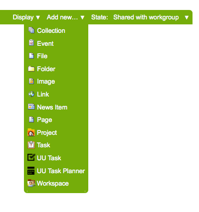

uu.task: UPIQ Task Management Add-on for Plone
==============================================

This repository serves as a place for development of a task managment add-on.

Copyright
---------

All content within this repository, unless otherwise noted elsewhere, is
Copyright 2015, University of Utah.  

Original works in this package are licensed under the GNU General Public
License v. 2.0. All original images, documentation, style-sheets, and 
JavaScript assets are additionally licensed under an MIT-style license.

See ``doc/COPYING.txt``

Contributors
------------

* `Sean Upton <https://github.com/seanupton>` (UPIQ, University of Utah Health Sciences)
* `Alex Clark <http://aclark.net/>` (ACLARK.NET, LLC)

Content Types
-------------

The ``uu.task`` add-on contains "UU Task" and "UU Task Planner" content types.

Add UU Task
~~~~~~~~~~~

Similar Add-ons
---------------

``uu.task`` is inspired by similar add-ons. Here is a list and comparison of each.

+--------------------------------------+---------------------------------------+---------------------------------------+---------------------------------------+
|                                      |                                       |                                       |                                       |
|                                      |                                       |                                       |                                       |
| **Add-ons**                          |  **Description**                      |  **Pros**                             |  **Cons**                             |
|                                      |                                       |                                       |                                       |
|                                      |                                       |                                       |                                       |
+--------------------------------------+---------------------------------------+---------------------------------------+---------------------------------------+
|                                      |                                       |                                       |                                       |
|                                      |                                       |                                       |                                       |
| Products.Poi_                        | Venerable AT-based issue tracker.     | N/A                                   | N/A                                   |
|                                      | Includes workflow for issue tracker   |                                       |                                       |
|                                      | and task.                             |                                       |                                       |
|                                      |                                       |                                       |                                       |
|                                      |                                       |                                       |                                       |
|                                      |                                       |                                       |                                       |
|                                      |                                       |                                       |                                       |
+--------------------------------------+---------------------------------------+---------------------------------------+---------------------------------------+
|                                      |                                       |                                       |                                       |
|                                      |                                       |                                       |                                       |
| collective.project_                  | Project management add-on whose       | N/A                                   | N/A                                   |
|                                      | Dexterity content types can behave    |                                       |                                       |
|                                      | like a collective.task_ task. E.g.    |                                       |                                       |
|                                      | "project", "client", "iteration".     |                                       |                                       |
|                                      | "Task" content                        |                                       |                                       |
|                                      | type included with                    |                                       |                                       |
|                                      | `collective.project`_ cannot be used  |                                       |                                       |
|                                      | with collective.task_                 |                                       |                                       |
|                                      | due to conflicting                    |                                       |                                       |
|                                      | "task" types.                         |                                       |                                       |
|                                      |                                       |                                       |                                       |
|                                      |                                       |                                       |                                       |
|                                      |                                       |                                       |                                       |
|                                      |                                       |                                       |                                       |
+--------------------------------------+---------------------------------------+---------------------------------------+---------------------------------------+
|                                      |                                       | It exists.                            | Supports "placeful" tasking.          |
|                                      |                                       |                                       |                                       |
| collective.task_                     | Supports "placeful" tasking. A task is+---------------------------------------+---------------------------------------+
|                                      | a folder that can contain other       | Allows assignment of task to group,   | No date widget.                       |
|                                      | (presumably dependent) tasks.         | user and "enquirer".                  |                                       |
|                                      |                                       +---------------------------------------+---------------------------------------+
|                                      |                                       | Includes "task" behavior which can    | Possibly no support for assignment of |
|                                      |                                       | be used by other Dexterity content.   | `more than one principal`_.           |
|                                      |                                       +---------------------------------------+---------------------------------------+
|                                      |                                       | Can be used as a task framework       |                                       |
|                                      |                                       | by other add-ons.                     |                                       |
|                                      |                                       +---------------------------------------+---------------------------------------+
|                                      |                                       |                                       |                                       |
|                                      |                                       |                                       |                                       |
|                                      |                                       +---------------------------------------+---------------------------------------+
|                                      |                                       |                                       |                                       |
|                                      |                                       |                                       |                                       |
+--------------------------------------+---------------------------------------+---------------------------------------+---------------------------------------+
|                                      |                                       |                                       |                                       |
|                                      |                                       |                                       |                                       |
|                                      |                                       |                                       |                                       |
|                                      |                                       |                                       |                                       |
|                                      |                                       |                                       |                                       |
+--------------------------------------+---------------------------------------+---------------------------------------+---------------------------------------+

.. _`Products.Poi`: https://github.com/collective/Products.Poi
.. _`collective.project`: https://github.com/collective/collective.project
.. _`collective.task`: https://github.com/collective/collective.task
.. _`more than one principal`: https://github.com/upiq/uu.task/issues/3
